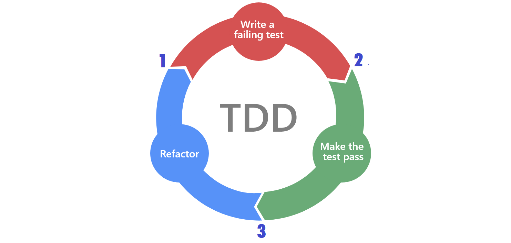

# Introduction to Test-Driven Development

## What is Test-Driven Development (TDD)?
* Test driven development (TDD), is based on test first approach. Tests drive the development.
* Test Driven Development is nothing but frequent or fast cycles of testing, coding and refactoring with testing before coding. 
* TDD (test-driven development) is a technique for designing the software as well as testing it.

## The Red-Green-Refactor Process
* The name comes from the states our code is in within the cycle. 
* When in the red state, code does not work
* When in the green state, everything is working as expected, but not necessarily in the best possible way. 
* Refactor is the phase when we know that features are well covered with tests and thus gives us the confidence to change it and make it better (aka clean it up).

### 1. RED - Write a failing test
* Every new feature starts with a test.
* The main objective of this test is to focus on requirements and code design before writing the code. 
* Since no code has been written to satisfy the test, running the test should result in failure.  
* Confirming that the last test is failing, confirms that the test would not, mistakenly, pass without the introduction of a new code.

### 2. GREEN - Make the Test Pass
* The purpose of this phase is to write code that will make the last test pass.
* DO NOT try to make it perfect, nor try to spend too much time with it. 
* If it's not well-written or is not optimum, that is still okay. It'll become better later on.
* What we're really trying to do is to create a safety net in the form of tests that are confirmed to pass. 
* Do not try to introduce any functionality that was not described in the last test.
* Once the code is written, ALL TESTS are run.
  * Running all the tests confirms not only that the implementation of the last test is correct, but also that it did not break the integrity of the application as a whole

### 3. REFACTOR
* Not every implementation of a test requires refactoring. 
* There is no rule that tells you when to refactor and when not to. 
* The best time is as soon as one gets a feeling that the code can be rewritten in a better or more optimum way

## The TDD Mantra
**Red → Green → Refactor  (Repeat)**   
* For ANY change you make to your code you want to move through this cycle rapidly. Which means you need to keep your tests simple and code changes minimal, just enough to past the test.
* **SPEED IS THE KEY!!**  The whole cycle should last anything between a couple of seconds and no more than a few minutes. If it takes more than that, the scope of a test is too big and should be split into smaller chunks. Be fast, fail fast, correct, and repeat.

## More on Refactoring
Quite simply, change up the code structure without changing its behavior.  It can be a matter of cleaning up your code by making it more maintainable – i.e placing reusable code in a function – or more efficient i.e  applying a binary search instead of a linear search.  In any case, the changes should not alter the test results.  If all tests have passed, they should still pass after refactoring.

### Why Refactor?
* it's hard to understand code
* the illogical location of a piece of code
duplication
* names that do not clearly state a purpose
long methods
* classes that do too many things, and so on. 

## Why TDD?
* **Meet objective** - with the specifications of a program always in mind, TDD ensures that your system actually meets requirements defined for it. It helps to build your confidence about your system.
* **Efficiency** - It makes testing an automated process (using testing tools) instead of manual print statements
* **Thoroughness** - since we create a test before any change, it ensures that all lines of code are tested
* **Maintenance** - Since we run all previous test when we make a change, we can make new changes with confidence.

