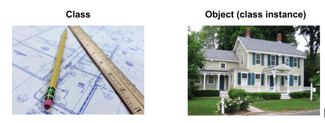

# Introduction to Object Oriented Programming

## What is OOP?
* Object-Oriented Programming
* Represent complex real-world things, consisting of numerous properties, capable of doing complex actions.
* A way of breaking our requirements into chunks that are more manageable than the whole
  * each chunk is **self-contained** yet potentially **reusable** by other programs, while working together as a whole with other chunks
  * chunks → **objects**
* when we code an object, we do so with a **class**
* class →  a blueprint of an object
* object → an **instance** of a class

> Think of a class as a blueprint –  you can't live in it, but you can build a house (an object) from it.

