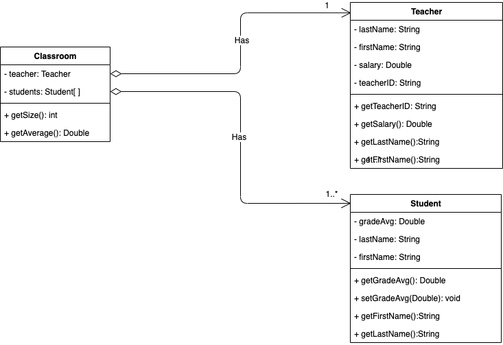

# Class Diagram



A core element of computer science is to be able to model a problem visually.  We use flowcharts to model an algorithm of a solution to a problem.  In object-oriented programming, we use Class Diagrams to model the relationship between objects.

Above is a **class diagram** indicating the relationship between objects.  Note the arrows that indicate the HAS-A relationship between `Classroom` and `Student`/`Teacher`

* in the `Classroom`-`Teacher` relationship, we indicate a 1 to 1 relationship, that is **one `Classroom` has one `Teacher`**.  Notice the `1` on the `Classroom` side of the arrow
* in the `Classroom`-`Student` relationship, we indicate a 1 to many relationship, that is **one `Classroom` has many `Student`**.  Notice the `1...*` on the `Classroom` side of the arrow


### Tools
We can use the **draw.io**(aka **diagrams.net**) app found in the Chrome Web Store to create our diagrams


### Class Blocks
* We can start our visualization with a standard Class block.  
specify fields (properties) include the name and type, along with + for public, - for private
* i.e - firstName: String
* specify methods that include the name, parameters names with type, and return type, + for public, - for private
i.e 
```
+ markBump(amount: Double): void
+ getMark(): Double
```

