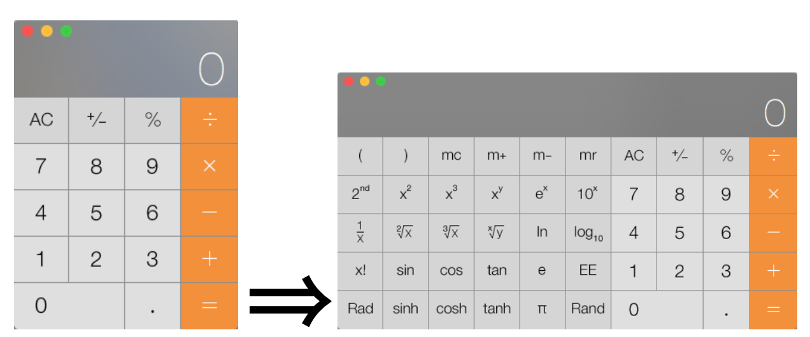
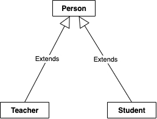
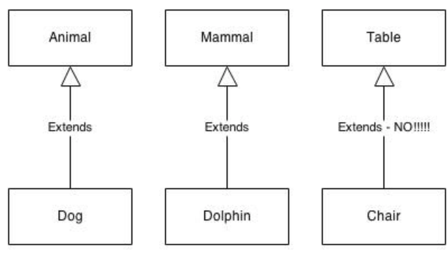

# Is-A Relationships - Inheritance

One of the major tenants of object-oriented programming is *resuabiity*, this could mean repeatedly making use of existing tested code, it also means taking existing code and extending its functionality to make it more useful.

What if there is a class that has loads of useful functionality in it but is not quite what we want? We can inherit from the class and then further refine or add to how it works and what it does.

## Inheritance in Real Life


Imagine you have a blueprint (**class**) for creating four-function calculators (+, -, x, /), from which you create calculators (objects).  If you wanted to use **inheritance** create a new design that also included other functions, such as square root, you would examine the original calculator design and then create a second blueprint.  

The New Blueprint
The new blueprint would only contain the new buttons (i.e square root), the circuitry for the new buttons, and whatever minor changes from the original calculator were required.  It would NOT contain elements that were unchanged from the original design (i.e power supply, LCD display, number buttons, clear buttons).  It would also contain a reference to the original blueprint, since you could not create calculators using the new blueprint without the original blueprint.  

So the design for the new Multi-function calculator is a combination of the two blueprints.  In computer science terms, the design of the Multi-function calculator *inherits from the design* of the four-function calculator.

## Inheritance in Programming
* In inheritance, you specify the class that your are inheriting from (the **super class**) and then express the additions or modifications to the super class in the subclass.  
* If a change is made in the super class, it is automatically reflected in the subclass.
* we can also call the super class a **parent class** and the subclass a **child class**.

  

### Example:  Person, Student, Teacher

  

In this arrangement, we have defined a `super` or parent class, `Person.java`, whose definition has been *extended* by the child classes `Student.java` and `Teacher.java`.  

Compare the `Student` and `Teacher` classes from previous lesson.
| Aggregation  | Inheritance  |
|---|---|
| [Student.java](../lesson3_HasArelationships/Student.java)  | [Student.java](./Student.java)  |
| [Teacher.java](../lesson3_HasArelationships/Teacher.java)  | [Teacher.java](./Teacher.java)  |

#### `extends`
Inheritance in java is achieved with the use of the `extend` keyword.  Notice the [`Student`](./Student.java#L4) and [`Teacher`](./Teacher.java#L4) class definition statements.  By including `extend`, the `Student` and `Teacher` classes become child classes to `Person`, *inheriting* all its properties and methods.
```
public class Student extends Person{
  ...
```

#### `super()`
* Recall that when you create an instance (object) of a class, we can specify how the object gets created through a constructor.   
* When we extend the definition of a class through inheritance (i.e Person extended to Student) we don't want to code the instructions in the parents constructor all over again (i.e `getFirstName()` and `getLastName()`).
* to eliminate redundancy, we can make a [call to the `super()`](./Student.java#L18) method, which allows you to trigger a parent constructor (Person) from a child class (Student)
parameters in the super() call should match the parameters of a parent constructor.
```
 public Student(String fname, String lname)
 {
   super(fname, lname);
   this.gradeAvg = 0.0; 
   totalStudents++;  // increase the student count
}
 ```


### Is-A vs. Has-A Relationships
* Classes have two main types of relationships. They are “is a” and “has a” relationships.
* **“has a”** relationships describe scenarios of **class aggregation**.
  * A Rectangle object has-a Point
  * A Classroom object has-a list of Students
  * A Car has-a Steering Wheel
* **“is-a”** relationships describe scenarios of **inheritance**.
  * A **parent** class should always be a more general, abstract version of the child class. 
  * This type of child-to-parent relationship is called an **"is a"** relationship. 
  * For example, a parent class Animal could have a child class Dog. The Dog class could have a child class Poodle. 
  * Another example, a dolphin is a mammal. It does not work the other way, a mammal is not necessarily a dolphin. So the class Dolphin should never be a parent to a class Mammal. 
  * Table should not be a parent to a class Chair because a chair is not a table.

    
  
  
  ### Example: Square Is A Rectangle
  
  #### Rectangle.java
```
  public class Rectangle
{
    private int width;
    private int height;
    
    public Rectangle(int rectWidth, int rectHeight)
    {
        width = rectWidth;
        height = rectHeight;
    }
    
    public int getArea()
    {
        return width * height;
    }
    
    public int getHeight()
    {
        return height;
    }
    
    public int getWidth()
    {
        return width;
    }
    
    public String toString()
    {
        return "Rectangle with width: " + width + " and height: " + height;
    }
}
```
  
#### Square.java
  
```
  public class Square extends Rectangle
{
    public Square(int sideLength)
    {
        super(sideLength, sideLength);
    }
    
    public int getSideLength()
    {
        return super.getHeight();
    }
    
    // Override toString in the subclass
    public String toString()
    {
        return "Square with side length: " + getHeight();
    }
    
}
```

  

  


